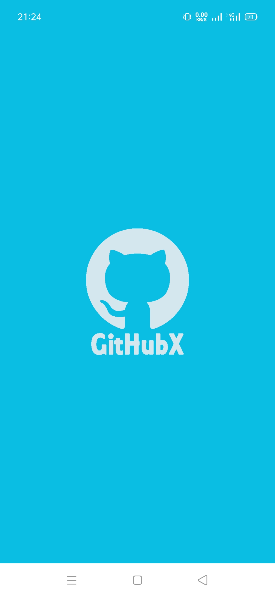
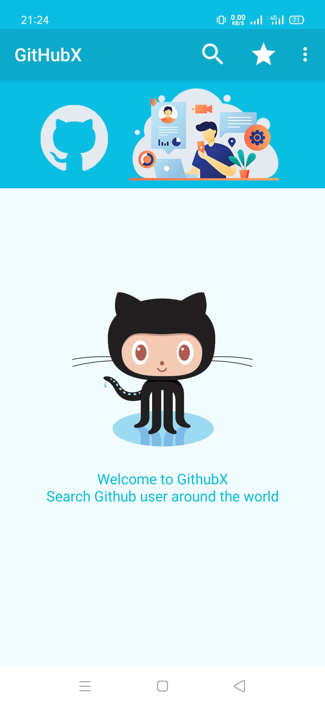
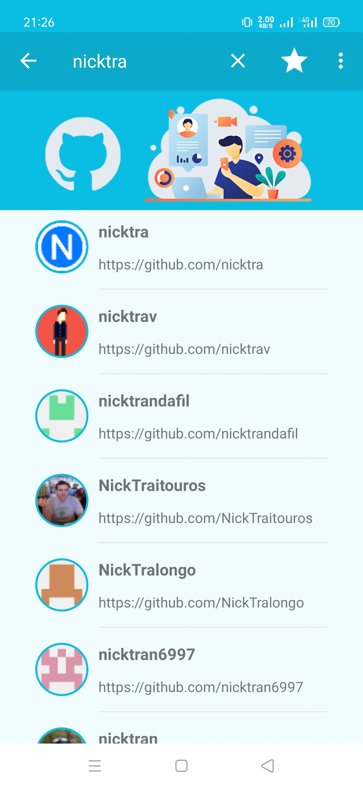
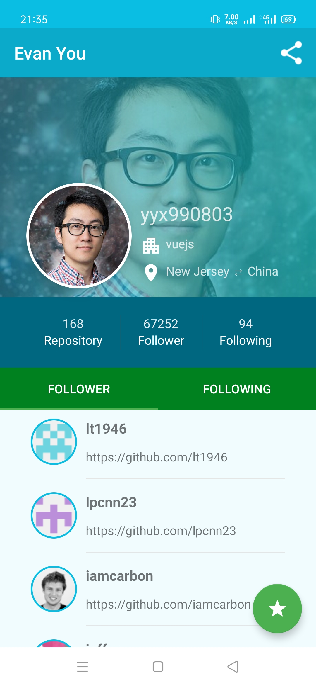
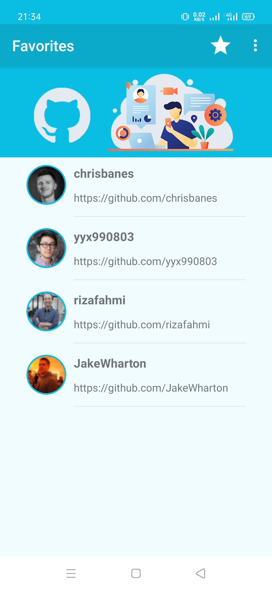
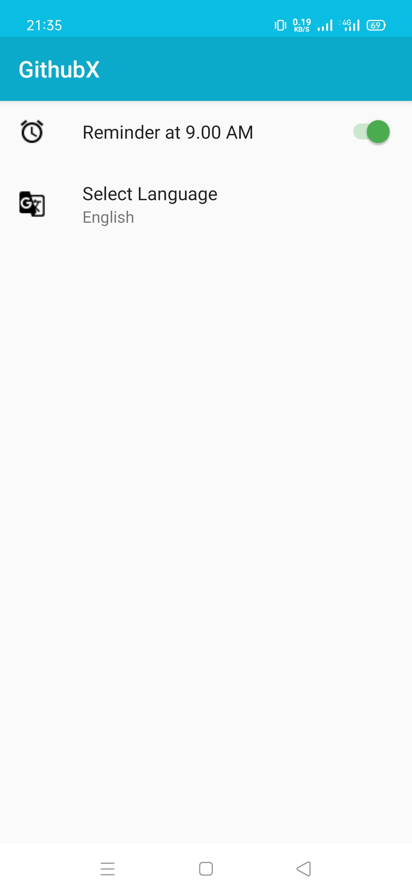
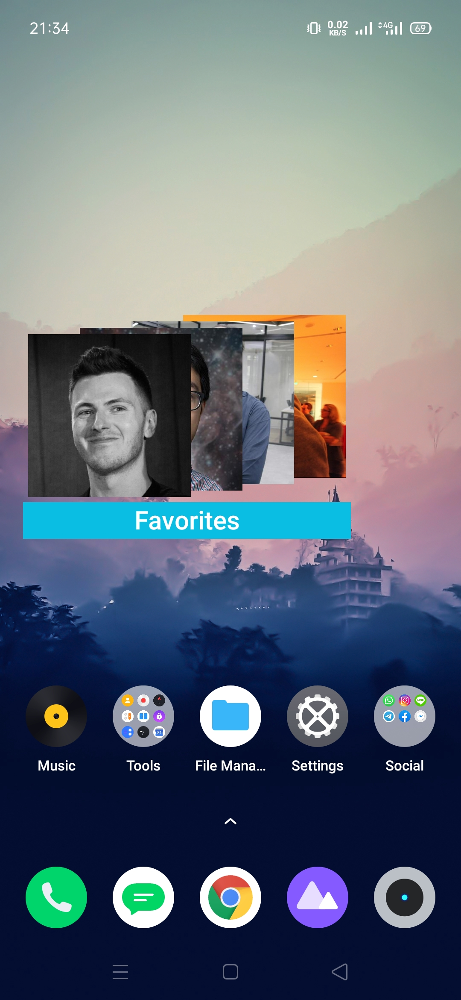
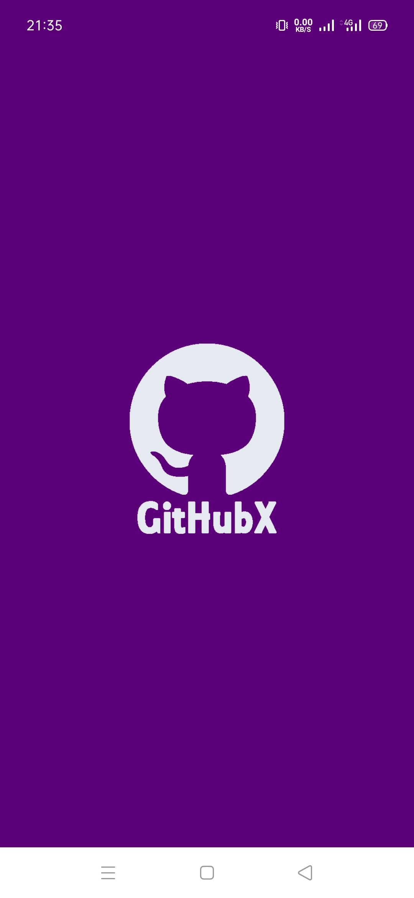
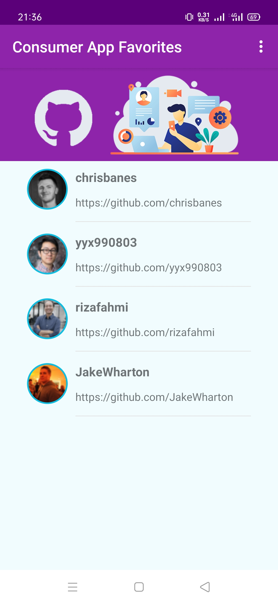
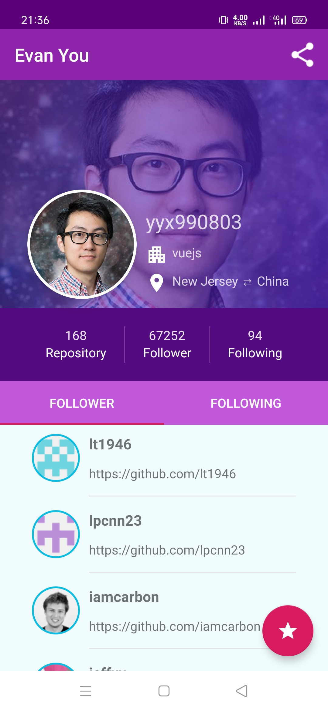

<p align="center">
  <a href="https://github.com/nicktra/githubx">
    
  </a>
</p>

<h3 align="center">GithubX</h3>

<p align="center">
    GithubX is android app about Github User.
    <br />
    <a href="https://github.com/nicktra/githubx"><strong>Explore the docs »</strong></a>
</p>

# GithubX

GithubX is android app about Github User.

## Getting Started

These instructions will get you a copy of the project up and running on your local machine for development and testing purposes.

### Prerequisites

Things you need to install the software and how to install them

* Android Studio (I use Android Studio 4.1.1)

### Installing

1. Clone the repo
```sh
git clone https://github.com/nicktra/githubx.git
```
2. Open with your Android Studio

## Features

* Search User
* Favorited User
* Detail User
* Share User
* Localization
* Notification
* Consumer App
* StackView Widget

## Screenshots App
<pre>
                                    
</pre>

## Built With

* [Kotlin](https://kotlinlang.org/) - The Programming Language
* [SQLite](https://developer.android.com/reference/android/database/sqlite/SQLiteDatabase.html) Contains the SQLite database management classes that an application would use to manage its own private database.
* [Alarm Manager](https://developer.android.com/reference/android/app/AlarmManager.html) Provides access to the system alarm services. These allow you to schedule your application to be run at some point in the future.
* [Notifications](https://developer.android.com/guide/topics/ui/notifiers/notifications) A message that Android displays outside your app's UI to provide the user with reminders, communication from other people, or other timely information from your app.
* [Content Provider](https://developer.android.com/guide/topics/providers/content-providers.html) Content providers can help an application manage access to data stored by itself, stored by other apps, and provide a way to share data with other apps.
* [Localization](https://developer.android.com/guide/topics/resources/localization) Android runs on many devices in many regions. To reach the most users, your app should handle text, audio files, numbers, currency, and graphics in ways appropriate to the locales where your app is used.
* [LoopJ](https://github.com/android-async-http/android-async-http) An asynchronous, callback-based Http client for Android built on top of Apache's HttpClient libraries.
* [Glide](https://github.com/bumptech/glide) is a fast and efficient open source media management and image loading framework for Android that wraps media decoding, memory and disk caching, and resource pooling into a simple and easy to use interface.
* [CircleImageView](https://github.com/hdodenhof/CircleImageView) A circular ImageView for Android.
* [App Widgets](https://developer.android.com/guide/topics/appwidgets/overview) Widgets are an essential aspect of home screen customization.

## Contributing

Contributions are what make the open source community such an amazing place to be learn, inspire, and create. Any contributions you make are **greatly appreciated**.

1. Fork the Project
2. Create your Feature Branch (`git checkout -b feature/AmazingFeature`)
3. Commit your Changes (`git commit -m 'Add some AmazingFeature'`)
4. Push to the Branch (`git push origin feature/AmazingFeature`)
5. Open a Pull Request

## Contact

* **Konik Saputra** - [@koniksaputra](https://twitter.com/koniksaputra) - koniksaputra@live.com

## License

This project is licensed under the MIT License. See `LICENSE` for more information